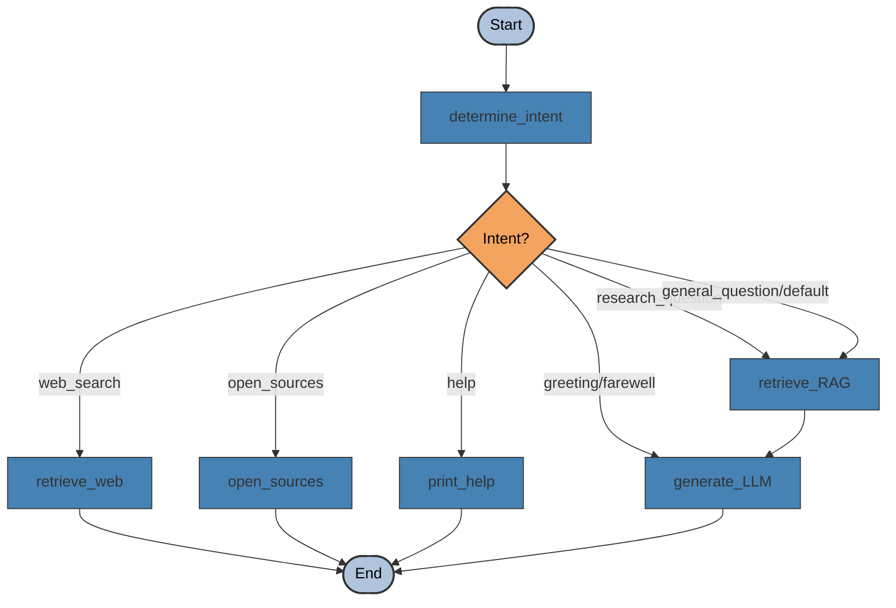

# LangGraph Workflow Visualization

This diagram visualizes the workflow of the Research Assistant system implemented using LangGraph.

## Node Descriptions

### 1. determine_intent
- **Purpose**: Analyzes the user query to determine its intent
- **Function**: Uses OpenAI to classify the query into predefined categories
- **Input**: User query
- **Output**: State with detected intent

### 2. retrieve_RAG
- **Purpose**: Retrieves relevant context from the Pinecone vector database
- **Function**: Searches for chunks of text related to the user's query
- **Input**: User query
- **Output**: State with retrieved context and has_research_data set to true

### 3. retrieve_web
- **Purpose**: Searches for academic papers related to the conversation
- **Function**: Uses the SERP API to search Google Scholar
- **Input**: Conversation history
- **Output**: State with web search results and assistant message

### 4. open_sources
- **Purpose**: Opens the found sources in the web browser
- **Function**: Uses the webbrowser module to open each link
- **Input**: Web results from previous searches
- **Output**: State with confirmation message

### 5. print_help
- **Purpose**: Generates a helpful response explaining how to use the bot
- **Function**: Uses OpenAI to create a help message based on the system message
- **Input**: Conversation history
- **Output**: State with help message

### 6. generate_LLM
- **Purpose**: Generates a response using GPT-4o
- **Function**: Uses OpenAI to create a response based on context and conversation
- **Input**: Conversation history and retrieved context
- **Output**: State with assistant's response

## Conditional Routing

The workflow routes the query based on the detected intent:

- **web_search**: Routes to `retrieve_web` to search for academic papers
- **research_question**: Routes to `retrieve_RAG` to get information from the vector database
- **open_sources**: Routes to `open_sources` to open found sources in the browser
- **help**: Routes to `print_help` to generate a help message
- **greeting/farewell**: Routes directly to `generate_LLM` to generate a simple response
- **general_question/default**: Routes to `retrieve_RAG` as the default path

## Flow Paths

1. **Research Question Path**: determine_intent → retrieve_RAG → generate_LLM → End
2. **Web Search Path**: determine_intent → retrieve_web → End
3. **Open Sources Path**: determine_intent → open_sources → End
4. **Help Path**: determine_intent → print_help → End
5. **Greeting/Farewell Path**: determine_intent → generate_LLM → End
6. **Default Path**: determine_intent → retrieve_RAG → generate_LLM → End
